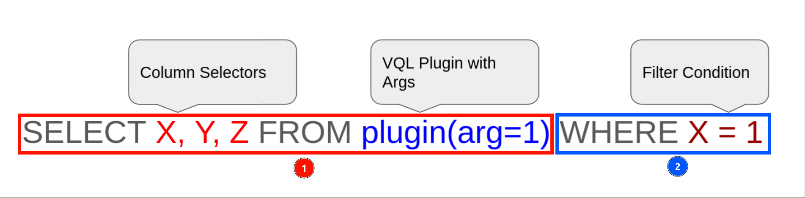

### Introduction to Velociraptor Query Languange (VQL)
In the fast-paced world of incident response, having the right tools and techniques can be the key to successfully detecting and responding to security threats. Velociraptor is a powerful digital forensics and incident response tool that provides a comprehensive solution for investigators and security professionals.

One of the key features of Velociraptor is Velociraptor Query Language (VQL), a framework for creating highly customized artifacts that allow you to collect, query, and monitor almost any aspect of an endpoint, groups of endpoints, or an entire network. VQL enables you to gather information about systems and devices, including operating system details, running processes, file systems, and network connections.

In addition to data collection, VQL can also be used to create continuous monitoring rules on the endpoint, as well as automate tasks on the server. This provides a powerful and flexible solution for managing and responding to security incidents, and enables security professionals to quickly detect and respond to potential threats.

## The Basics
In order to fully appreciate the Velociraptor Query Language, it is important to understand the syntax and basic structure of a query. If you are already familiar with SQL (Structured Query Language), VQL will be more familiar and easy to pick up. First, lets look at the basic structure of a VQL query:




The above image shows the most basic structure of a VQL query. For the purpose of this scenario, we will use the keywords:

1. **Query Header** to reference the first portion of the query (1).
2. **Query Body** to reference the last portion of the query (2).

When running any VQL query, we normally have the above basic structure, where, in the **Query Header** we define the specific columns we want to select or any function we want to run, on the row of data we get. In the **Query Body,** we apply any conditional filters to filter out the data we have collected from the endpoint.

If you are wondering, why I’m saying row of data or columns, that's because, VQL produces a row of data (tabular). Unlike SQL where we query an entire existing database, for VQL, we are running a set of operations on the endpoint, to generate a tabular row of data to work with. Will get into that shortly.

## Statements and Clauses

Alright, we need to spend a bit more time here. VQL uses the following statements/clauses:

- **SELECT** – the traditional column selector.
- **FROM** – to specify data source, in VQL, the plugin to use.
- **WHERE** – apply a conditional filter.
- **LET** – used to store queries. Quite useful when working with **subqueries**.
- **AS** – used to rename the column selectors/symbols of a query. Is quite useful when working with **subqueries**.

Alright, gotten the gist? Great! Let’s dive a little deeper:

### Understanding Plugins and Functions.

Before you can run a VQL query using the above statements and clauses, we need to talk about functions and plugins. 

### Functions

A function in VQL can be slightly confusing, especially if you come from a programming background. For starters, yes, you can define a function, you can use an existing function, and functions can take arguments as well. However, with a function, its main role in VQL, is to take several rows of data/values and transform them into a single value. Don’t worry, will come back to functions, for now, note this, functions are placed in between the **`SELECT`** and **`FROM`** clauses.

### Plugins

To understand plugins, keep this in mind, SQL was designed to work on static tables in a database. In SQL, you have operations like **`JOIN`** or **`HAVING`** , this complex SQL clauses are used, for example, JOIN, to combine rows from two or more tables. VQL does not have such complex clauses, what VQL uses, are **Plugins**. Plugins replace the complex operations that the clauses such as **`JOIN`** perform. 

How does it do this? Unlike SQL, VQL is not retrieving its data from a static table in a database, but rather, VQL runs a plugin which will then generate the rows of data. Therefore, a plugin is a given operation/code that executes on the endpoint(s), the result of that particular operations, is then collected as a set of rows.

### Putting it all together.

Alright, we know the basic structure, what functions are, and the vital role plugins play. Now, let’s actually look at our first example of a VQL query:

```yaml
SELECT * FROM info()
```

The above is the equivalent of  the “**Hello World**” code, as Mike Cohen puts it (creator of Velociraptor). This VQL query performs the following:

- **`SELECT`** *:* you guessed it, we are using the (*) wildcard to select all the possible columns within our row of data.
- **`FROM info()`**: we are then defining our data source, which is the plugin **info()**. This plugin will collect information about our current system (host running velociraptor).

Before we actually run the VQL, let’s have one last example, that uses a function.

```yaml
SELECT *, count() FROM info()
```

We are not straying far from our starter query, however, for this query, we are introducing a function. The function in this case being **count()**, which, well, will count the rows of data that are collected from our plugin (not only what it can do, but for this context, that’s basically what it will do).

Before we move any further, let us actually run some queries, so we can get familiar with VQL.
